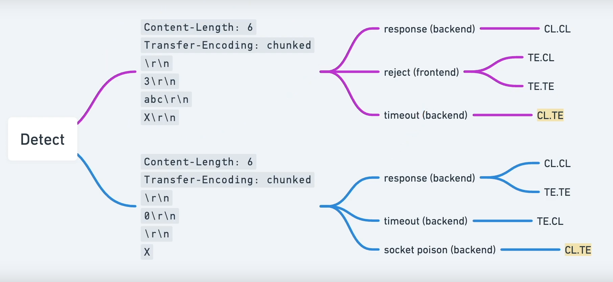

El ataque de **CL.TE** (Content-Length to Transfer-Encoding), cuando el atacante usa la cabecera `Content-Length` para influenciar la interpretación del front-end, mientras que el back-end se ve influenciado por la cabecera `Transfer-Encoding`.
        
        En la raiz editamos desde el burpsuite:

        Dentro del código podemos probar diferentes http request y según su respuesta podemos confirmar que hay un tipo de vulnerabilidad. CL.TE es cuando el backend está leyendo el content length y el frontend está leyendo el tra

        El frontend va a interpretas la X como la finalización de la petición http pero el backend va a leer el chunked e interpetara el resto del código
        

 