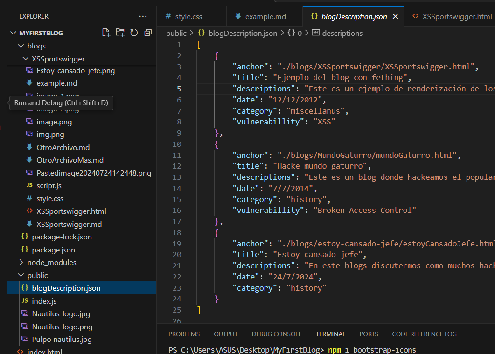
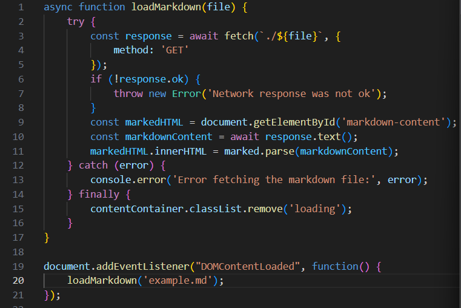
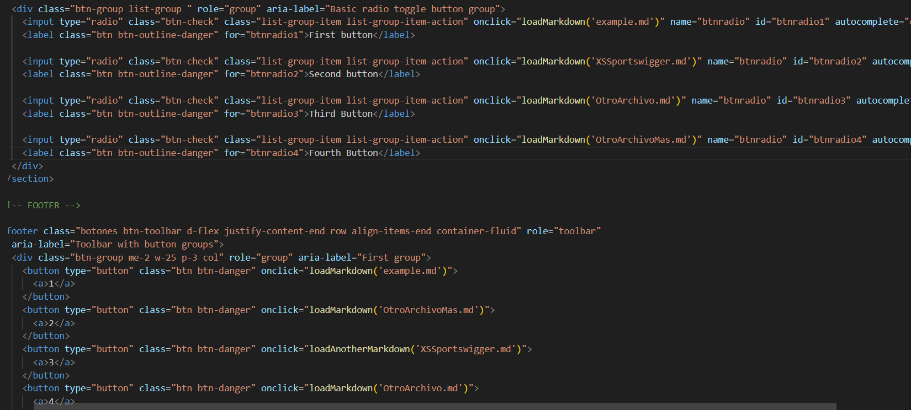

### Esta es la explicación de la página con el método fetch
## Vea ambos blogs y decida como desarrollar su página
- - -
En este archivo pretendo describir brevemente el método fetch y como utilizar esta página en función a la librería [marked.js](https://marked.js.org/), la cual automatiza el proceso de pasar del lenguaje md a html. 

Lo primero que hay que entender es que los buscadores nativamente leen lenguaje HTML5 (html, css, Javascript) por lo que si queres poner markdown en nuestra página debemos pasarlo a lenguaje html. Esto significa que el markdown que lees aca esta pasado a html, si le das a inspeccionar verás las etiquetas. Osea que si queres personalizar algo debes cambiar esa etiqueta en sí en css.

Los json están dentro de la carpeta public, está carpeta es de acceso publico y se puede acceder de forma absoluta, ejemplo de ruta: 
    ``` 
    /public/path
    ``` que es donde está el json, "blogDescription.json" el cual se debe actualizar para generar las descripciones y links 



El método fetch es un método nativo de JavaScript el cuál sirve para solicitar recursos en la red (en este caso archivos locales dentro del VScode) mediante el método http.

En este caso estamos utilizando un parametro "file" el cual será la url de la página a la que queremos llamar los eventos "onClick" llaman a la función y le pasan el parametro, las rutas de los puntos md para que cada botón llame al archivo .md y se renderice. La dunción del final es el archivo .md qeu se carpara por defecto dentro de este blog.

Las demás páginas están para rellenar